# Proposal: Develop as Integration Branch
## Cross-repository branching strategy for large teams

---

## 🎯 Overview

**Current workflow remains unchanged.** We're adding `develop` as an optional integration branch for teams that need to share staging environments.

---

## 📊 Git Flow Diagram


<!--

-->

## ✅ Current Flow (NO CHANGES)

**Everything stays the same:**

1. Developer creates feature branch from `master`
2. Development happens on feature branch
3. **PR directly to `master`** (as always)
4. Code review + CI/CD validation
5. Merge to `master`
6. Deploy to production

```
feature-branch → PR → master → production
```

**Branch protection on master:**
- ✓ Require PR reviews (2+)
- ✓ Require CI/CD passing
- ✓ No direct pushes
- ✓ PRs accepted from any feature branch

---

## 🆕 NEW: Develop Branch

**Purpose:** Optional integration/staging environment for testing

**Key characteristics:**
- ⚠️ **No one can push directly to develop**
- 🤖 **Auto-syncs from master** after every merge (GitHub Action)
- 🧪 **Used for staging deployments** and integration testing
- ❌ **Does NOT block PRs to master** - it's completely optional

### How develop works:

```mermaid
sequenceDiagram
    participant Dev as Developer
    participant Feature as feature-branch
    participant Develop as develop
    participant Master as master
    participant GHA as GitHub Action
    participant Staging as Staging Env

    Note over Dev,Staging: Scenario 1: Solo Testing
    Dev->>Feature: Work on feature
    Dev->>Develop: Manual merge (local)
    Develop->>Staging: Auto-deploy
    Dev->>Dev: Test in staging
    Dev->>Master: PR when ready
    Master->>GHA: Merge triggers action
    GHA->>Develop: Auto-sync develop ← master

    Note over Dev,Staging: Scenario 2: Shared Environment
    Dev->>Feature: Developer A has feature-A
    Dev->>Develop: Merge feature-A to develop
    Dev->>Feature: Developer B has feature-B
    Dev->>Develop: Merge feature-B to develop
    Develop->>Staging: Deploy A+B together
    Dev->>Dev: Both test integration
    Dev->>Master: Each PR independently
```

<!--

-->

### Detailed Flow: Case 2 (Multiple Developers)


<!--

-->

---

## 💡 Use Cases

### Case 1: Solo Testing (Single Developer)
**When only ONE developer is working on the repository**

**✅ RECOMMENDATION: Skip the develop branch entirely**

If you're the only developer working on the repository, you don't need to use the `develop` branch. Follow the standard workflow:

```bash
# Work on your feature branch
git checkout -b feature/my-feature
# ... make changes ...
git add .
git commit -m "feat: implement my feature"
git push origin feature/my-feature

# Create PR directly to master
# After PR approval and CI/CD passing → merge to master → deploy to production
```

**Why skip develop?**
- No coordination needed with other developers
- No risk of conflicts or integration issues
- Simpler workflow: feature → master → production
- Faster delivery cycle

---

### Case 2: Shared Environment (Multiple Developers)
**When TWO OR MORE developers need to coordinate and share the staging environment**

#### 🔍 How to know if someone else is working?

**Check the deployment dashboard/logs in your staging environment:**
- See recent deployments with timestamps
- View which branch or tag is currently deployed
- Identify if another developer recently deployed their feature

**Example:** If you see a recent deployment like:
```
Deployed: feature/payment-integration (by dev-maria) - 10 minutes ago
```

This tells you that Maria is testing her payment feature in staging, and you should coordinate with her creating a thread in slack channel #integration-deploy.

---

#### 📋 Complete Workflow for Case 2

**Scenario:** Developer A is testing `feature/payment-integration` and Developer B needs to test `feature/fraud-detection` in the same staging environment.

##### Step 1: Developer A deploys to staging first

```bash
# Developer A merges their feature to develop
git checkout develop
git pull origin develop
git merge origin/feature/payment-integration
git push origin develop

# → Auto-deploy to staging triggered
# → Developer A tests payment integration in staging
```

##### Step 2: Developer B checks staging and sees Developer A's deployment

Developer B checks the staging environment dashboard and sees:
```
Current deployment: develop (containing feature/payment-integration by dev-A)
Branch: develop
Last commit: "merge: integrate payment-integration"
Deployed: 15 minutes ago
```

##### Step 3: Developer B coordinates by integrating with A's changes

```bash
# Developer B first pulls the latest develop (which already has A's changes)
git checkout develop
git pull origin develop

# ✅ At this point, develop already contains feature/payment-integration
# ✅ No need to merge it again - just merge B's feature on top

# Now merge B's feature on top of A's changes
git merge origin/feature/fraud-detection

# If conflicts occur between the two features, resolve them now
# (This is integration testing at the code level)
git status  # Check for conflicts
# ... resolve any conflicts ...
git add .
git commit -m "merge: integrate fraud-detection with payment-integration"

git push origin develop

# → Auto-deploy to staging triggered
# → Now staging has BOTH features: payment + fraud detection
```

##### Step 4: Both developers test integration

Both features are now deployed to staging:
- Developer A can continue testing payment integration
- Developer B can test fraud detection
- **IMPORTANT:** Both can test that their features work together (integration testing)

##### Step 5: Collect evidence and create PRs independently

```bash
# Developer A is satisfied with tests
# Creates PR: feature/payment-integration → master
# After approval → merge to master

# → GitHub Action automatically syncs develop with master
# → develop now has payment-integration from master + fraud-detection still pending
```

##### Step 6: Auto-sync preserves unmerged changes

When Developer A's PR merges to master, the GitHub Action runs:

```bash
# Automatic (GitHub Action does this)
git checkout develop
git fetch origin master
git merge origin/master -m "chore: auto-sync develop with master [skip ci]"
git push origin develop

# Result: develop now contains:
# ✅ payment-integration (merged from master - production ready)
# ✅ fraud-detection (still testing - not yet merged to master)
```

**⚠️ Can this auto-sync cause conflicts?**

**Usually NO**, if you follow the workflow correctly:
- Feature branches are created from master
- Same commits go to both develop and master
- Git recognizes commits already in develop

**Conflicts CAN happen if:**
1. Developer A modified `feature/payment-integration` after merging to develop but before merging to master
2. Different merge conflict resolutions exist in develop vs master
3. Someone pushed directly to develop (violating workflow)

**If conflicts occur:**
- GitHub Action will fail and create an issue automatically
- Manual resolution required (see Troubleshooting section)
- This is rare if workflow is followed correctly

**Best practice to avoid conflicts:**
- ✅ Don't modify feature branch after merging to develop
- ✅ Create PR to master immediately after testing in staging
- ✅ Never push directly to develop

Developer B can continue testing with confidence that:
- A's code is now production-ready and in develop
- B's code is still being tested
- Auto-sync will be clean if workflow was followed

##### Step 7: Developer B finishes and merges to master

```bash
# Developer B creates PR: feature/fraud-detection → master
# After approval → merge to master

# → GitHub Action automatically syncs develop with master again
# → develop is now fully synchronized with master
```

---

#### 🎯 Complete Git Command Reference

**For Developer A (First to use staging):**
```bash
# 1. Ensure your feature branch is up to date
git checkout feature/payment-integration
git pull origin feature/payment-integration

# 2. Switch to develop and integrate your feature
git checkout develop
git pull origin develop
git merge origin/feature/payment-integration

# 3. Push to trigger staging deployment
git push origin develop

# 4. Test in staging environment

# 5. When tests pass, create PR to master ( or Open the PR that were in Draft )

- Implemented payment integration
- Tested in staging environment
- Evidence: in the jira ticket and in the pr too if you want for an easy code review"

# 6. After PR approval and merge to master
# → GitHub Action automatically updates develop
# → No manual action needed
```

**For Developer B (Joining staging with A's work):**
```bash
# 1. Check staging environment to see what's deployed
# View deployment logs/dashboard to see: feature/payment-integration deployed

# 2. Ensure your feature branch is up to date
git checkout feature/fraud-detection
git pull origin feature/fraud-detection

# 3. Switch to develop and pull latest (includes A's changes)
git checkout develop
git pull origin develop

# 4. Integrate your feature on top
git merge origin/feature/fraud-detection

# 5. Resolve any merge conflicts if they exist
# (If conflicts occur between your feature and A's feature)
git status
# ... resolve conflicts in affected files ...
git add .
git commit -m "merge: integrate fraud-detection with payment-integration"

# 6. Push to trigger staging deployment
git push origin develop

# 7. Test both features together in staging

# 8. When tests pass, create PR to master
- Implemented fraud detection
- Tested in staging environment with payment-integration
- Integration test passed
- Evidence: in the jira ticket and in the pr too if you want for an easy code review

# 9. After PR approval and merge to master
# → GitHub Action automatically updates develop
# → develop will be equal to master and clean for future integrations
```

---

#### 🔄 Understanding Auto-Sync After Master Merge

**What happens automatically when a PR merges to master?**

The GitHub Action (`sync-develop.yml`) runs and executes:

```bash
# Triggered automatically on push to master
git checkout develop
git fetch origin master
git merge origin/master -m "chore: auto-sync develop with master [skip ci]"
git push origin develop
```

**Key behaviors:**

✅ **Preserves unmerged work:** If develop has features not yet in master, they remain in develop after sync

✅ **No conflicts if following workflow:** Since feature branches originate from master and merge to master first, the auto-sync is typically fast-forward or clean merge

✅ **Notification on failure:** If auto-sync fails (rare), GitHub Action creates an issue for manual resolution

**Example Timeline:**

```
Time 0: develop = master (both at commit A)
Time 1: Dev A merges feature-1 to develop → develop = A + feature-1
Time 2: Dev B merges feature-2 to develop → develop = A + feature-1 + feature-2
Time 3: Dev A's PR merges to master → master = A + feature-1
Time 4: GitHub Action runs → develop = master + feature-2 = A + feature-1 + feature-2
Time 5: Dev B's PR merges to master → master = A + feature-1 + feature-2
Time 6: GitHub Action runs → develop = master = A + feature-1 + feature-2
```

---

#### ⚠️ Important Notes for Case 2

1. **Communication is key:** When you see someone else's deployment in staging, coordinate with them via Slack in our channel called #integration-deploy 

2. **Merge order matters:** If you're adding your feature to develop, always pull the latest develop first to include others' work

3. **Test integration:** When multiple features are in develop, test that they work together, not just individually

4. **Independent PRs:** Each feature still creates its own PR to master - no dependencies

5. **Evidence collection:** Before creating PR to master, collect test evidence from staging (logs, screenshots, test reports)

6. **Auto-sync is automatic:** You never manually sync develop from master - the GitHub Action handles this

---

## 📊 Quick Reference: Case 1 vs Case 2

| Aspect | Case 1: Solo Developer | Case 2: Multiple Developers |
|--------|------------------------|------------------------------|
| **Use develop branch?** | ❌ No - skip it entirely | ✅ Yes - required for coordination |
| **Workflow** | `feature → master → production` | `feature → develop (test) → master → production` |
| **Staging deployment** | Optional - can test locally or in personal env | Required - shared staging environment |
| **Coordination needed?** | ❌ No | ✅ Yes - check deployment dashboard |
| **Merge conflicts risk** | Low - no parallel work | Medium - coordinate timing |
| **PR creation** | Direct to master when ready | To master after staging tests pass |
| **Deploy to staging** | Not needed (or use feature branch directly) | Merge to develop to deploy |
| **Evidence collection** | Can be done in dev/local | Must be done in staging environment |
| **Development speed** | ⚡ Fastest - no overhead | 🐢 Slower - coordination needed |

---

## 🔧 Troubleshooting & FAQs

### Q: What if develop gets out of sync with master?

**A:** This should never happen due to auto-sync, but if it does:

```bash
# Manual fix (requires admin permissions)
git checkout develop
git fetch origin master
git reset --hard origin/master
git push --force origin develop

# Warning: This will discard any work in develop not yet in master
# Make sure all developers have merged their PRs first!
```

### Q: What if auto-sync fails due to conflicts?

**A:** The GitHub Action will create an issue. To resolve:

```bash
# 1. Check the conflict
git checkout develop
git fetch origin master
git merge origin/master

# 2. Resolve conflicts manually
# Edit conflicting files
git add .
git commit -m "fix: resolve auto-sync conflicts"
git push origin develop

# 3. The conflict usually means someone pushed directly to develop (not allowed)
# Investigate who pushed and why
```

### Q: Can I push directly to develop?

**A:** No, develop should be protected. Only two ways to update develop:
1. Manual **local** merge of feature branches (then push)
2. Automatic sync from master (GitHub Action)

### Q: What if I accidentally merged to develop and broke staging?

**A:** You have two options:

```bash
# Option 1: Revert your merge
git checkout develop
git revert HEAD  # Reverts the last commit
git push origin develop

# Option 2: Reset develop to master (nuclear option)
git checkout develop
git reset --hard origin/master
git push --force origin develop
# Warning: Discards ALL work in develop!
```

### Q: Should feature branches be created from master or develop?

**A:** **Always create from master:**

```bash
# ✅ Correct
git checkout master
git pull origin master
git checkout -b feature/my-feature

# ❌ Wrong
git checkout develop
git checkout -b feature/my-feature
```

Feature branches from develop can cause issues when merging to master.

### Q: Can I merge develop back to my feature branch?

**A:** Generally **avoid** this. But if you need Developer B's changes in your feature:

```bash
# ❌ Don't do this (creates complex merge history)
git checkout feature/my-feature
git merge develop

# ✅ Do this instead (rebase on master + cherry-pick if needed)
git checkout feature/my-feature
git rebase master

# If you specifically need DevB's changes that aren't in master yet:
# Coordinate with DevB to merge their feature branch into yours
git merge origin/feature/other-feature
```

### Q: What happens if both developers merge to develop at the same time?

**A:** Git will handle it:
- If changes don't conflict: automatic merge
- If changes conflict: second push will fail, requiring pull + conflict resolution

```bash
# Developer B's push fails
git push origin develop
# Error: failed to push some refs

# Fix it
git pull origin develop
# Resolve any conflicts
git add .
git commit -m "merge: resolve conflicts with feature-A"
git push origin develop
```

### Q: When should I create the develop branch?

**A:** Only create it when you have 2+ developers actively working:

```bash
# Create develop branch from master
git checkout master
git pull origin master
git checkout -b develop
git push origin develop

# Set up branch protection rules in GitHub
# Set up auto-sync GitHub Action
```


## 🔒 Branch Protection Rules

### MASTER
- ✓ Require pull request reviews (2+)
- ✓ Require status checks to pass (CI/CD)
- ✓ No direct pushes allowed
- ✓ PRs accepted from any feature branch
- ✓ Deploys to production

### DEVELOP
- ✓ Auto-updates from master (GitHub Action)
- ✓ No direct pushes (protected)
- ✓ Manual local merges only (for testing)
- ✓ Deploys to staging/integration environment
- ⚠️ Does NOT block or gate merges to master

---

## 🤖 GitHub Action Configuration

Create `.github/workflows/sync-develop.yml`:

```yaml
name: Auto-sync develop from master

on:
  push:
    branches:
      - master

jobs:
  sync-develop:
    runs-on: ubuntu-latest

    steps:
      - name: Checkout develop
        uses: actions/checkout@v4
        with:
          ref: develop
          fetch-depth: 0
          token: ${{ secrets.GITHUB_TOKEN }}

      - name: Configure Git
        run: |
          git config user.name "github-actions[bot]"
          git config user.email "github-actions[bot]@users.noreply.github.com"

      - name: Attempt merge master into develop
        id: merge
        continue-on-error: true
        run: |
          git fetch origin master
          echo "Merging master into develop..."

          if git merge origin/master -m "chore: auto-sync develop with master [skip ci]"; then
            echo "merge_status=success" >> $GITHUB_OUTPUT
            git push origin develop
            echo "✅ Merge successful and pushed to develop"
          else
            echo "merge_status=conflict" >> $GITHUB_OUTPUT
            echo "❌ Merge conflicts detected"
            echo "Conflicting files:"
            git diff --name-only --diff-filter=U
            exit 1
          fi

      - name: Create detailed issue on conflict
        if: steps.merge.outputs.merge_status == 'conflict'
        uses: actions/github-script@v7
        with:
          script: |
            const conflictInfo = `## 🔴 Auto-sync Conflict Detected

            The automatic sync from \`master\` to \`develop\` has failed due to merge conflicts.

            ### What happened?
            - A PR was merged to \`master\`
            - GitHub Action tried to merge \`master\` into \`develop\`
            - Merge conflicts were detected

            ### Possible causes:
            1. ⚠️ Feature branch was modified after merging to develop but before merging to master
            2. ⚠️ Different conflict resolutions in develop vs master
            3. ⚠️ Someone pushed directly to develop (violates workflow)

            ### How to fix:

            \`\`\`bash
            # 1. Clone and checkout develop
            git checkout develop
            git pull origin develop

            # 2. Try to merge master
            git fetch origin master
            git merge origin/master

            # 3. Resolve conflicts in affected files
            git status  # See conflicting files
            # Edit files to resolve conflicts
            git add .
            git commit -m "fix: resolve auto-sync conflicts from master"

            # 4. Push to develop
            git push origin develop
            \`\`\`

            ### Prevention:
            - ✅ Don't modify feature branches after merging to develop
            - ✅ Create PR to master immediately after staging tests
            - ✅ Never push directly to develop

            **Triggered by:** ${context.payload.head_commit.message}
            **Commit:** ${context.sha}
            **Author:** ${context.payload.head_commit.author.name}
            `;

            await github.rest.issues.create({
              owner: context.repo.owner,
              repo: context.repo.repo,
              title: '🔴 Auto-sync Conflict: develop ← master',
              body: conflictInfo,
              labels: ['infrastructure', 'urgent', 'merge-conflict'],
              assignees: [context.payload.head_commit.author.username].filter(Boolean)
            });

      - name: Notify on other failures
        if: failure() && steps.merge.outputs.merge_status != 'conflict'
        uses: actions/github-script@v7
        with:
          script: |
            await github.rest.issues.create({
              owner: context.repo.owner,
              repo: context.repo.repo,
              title: '⚠️ Develop sync failed (non-conflict error)',
              body: `Auto-sync from master to develop failed due to an unexpected error.

              Check the [workflow run](${context.payload.repository.html_url}/actions/runs/${context.runId}) for details.`,
              labels: ['infrastructure', 'urgent']
            });
```

### Key Features of this GitHub Action:

1. **Conflict Detection**: Detects merge conflicts and creates a detailed issue
2. **Detailed Instructions**: Provides step-by-step resolution guide
3. **Auto-assignment**: Assigns the issue to the developer who triggered the merge
4. **Conflict Prevention Tips**: Includes best practices to avoid future conflicts
5. **Continue on error**: Doesn't fail silently - always creates an issue for manual fix

---

## ✨ Benefits

### 1️⃣ **No Changes to Current Workflow**
Developers continue working exactly the same way. Zero disruption.

### 2️⃣ **Optional Shared Environment**
When 2+ people need to test together, they can coordinate via develop.

### 3️⃣ **Master Always Clean**
Develop automatically resets to match master after every merge. No drift.

### 4️⃣ **Integration Testing**
Test multiple features together before they hit production.

### 5️⃣ **Does Not Block Deliveries**
Each feature merges to master independently. No gatekeeping.

### 6️⃣ **Reduces Resource Contention**
Less waiting for staging environments. Multiple teams can coordinate better.

---

## 🚀 Deployment Pipeline


<!--
```mermaid
graph LR
    A[Feature Branch] -> |PR + Review| B[Master]
    B ->|Manual Deploy| C[Staging (+Approval) -> Sandbox -> Production]
    B -.->|Auto Sync| D[Develop]
    A -.->|Manual Merge| D
    D ->|Auto Deploy| E[Staging/Integration]
    
    style B fill:#f44336,stroke:#c62828,color:#fff
    style D fill:#9c27b0,stroke:#6a1b9a,color:#fff
    style C fill:#4caf50,stroke:#2e7d32,color:#fff
    style E fill:#ff9800,stroke:#e65100,color:#fff
```
-->